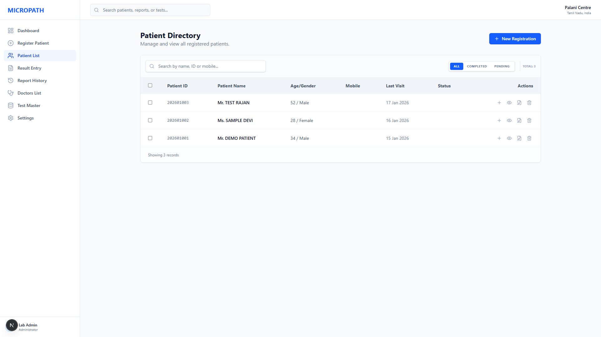
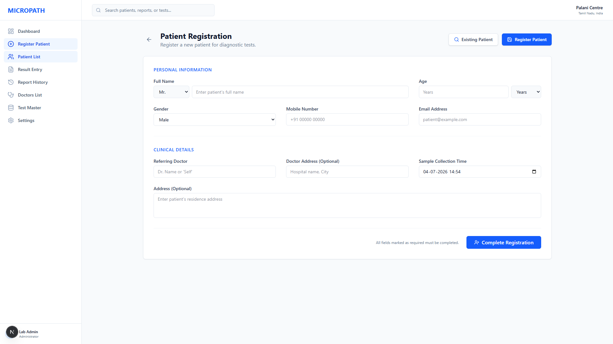
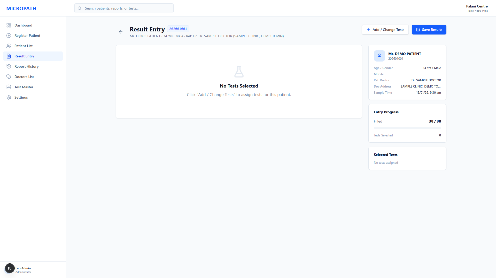
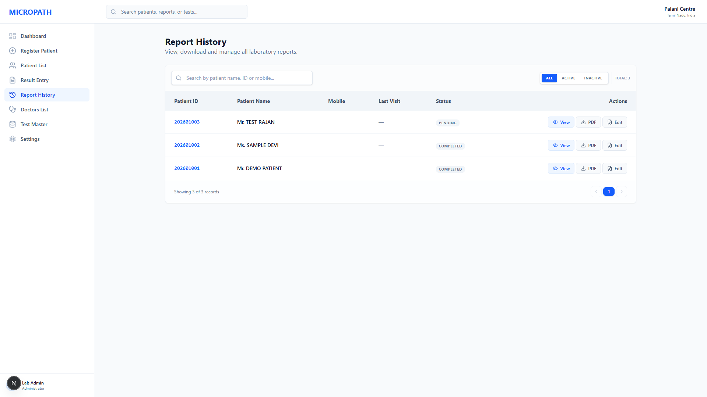
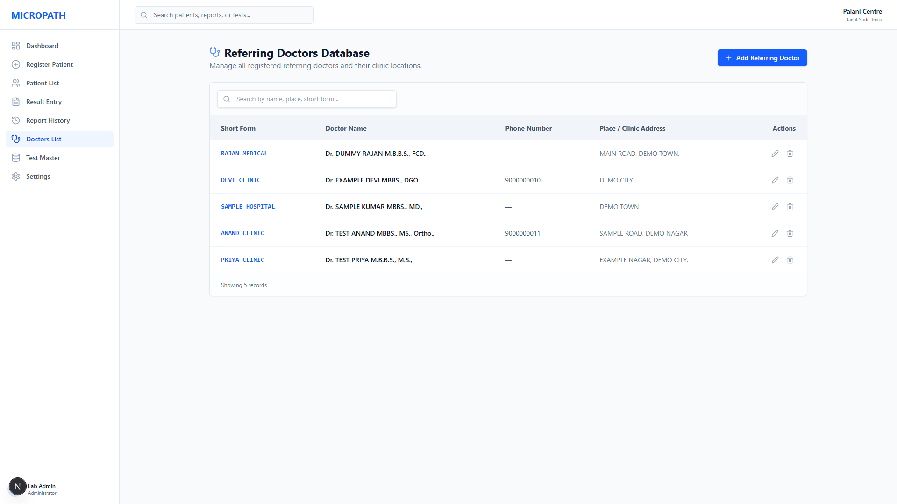
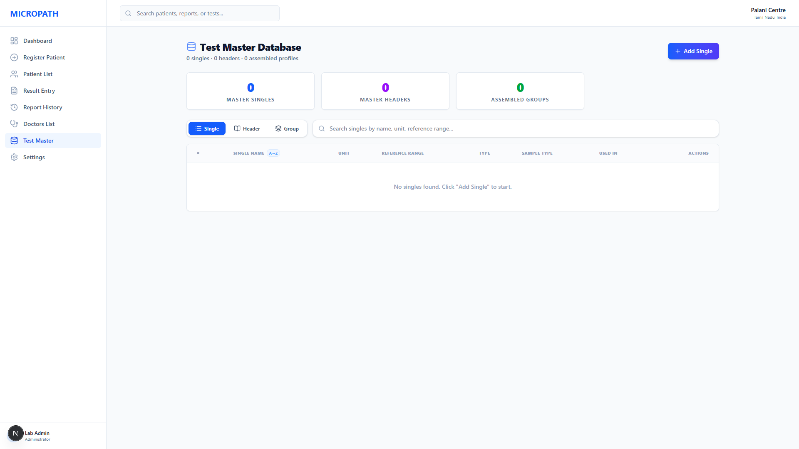
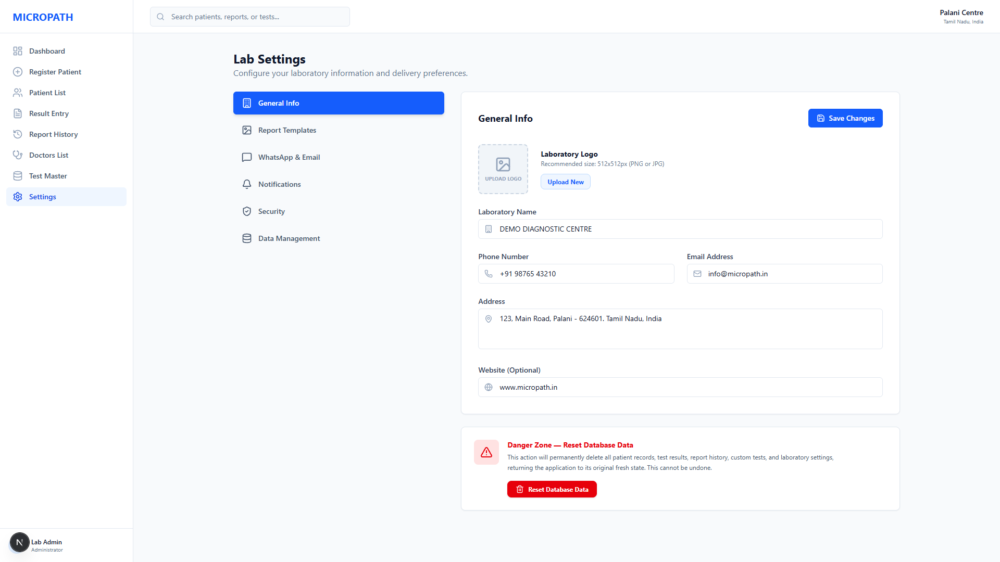

# 🏥 Healthcare Laboratory & Patient Management System

A full-featured web-based laboratory management system built for diagnostic
centres to manage patients, lab tests, reports, referring doctors, and
delivery notifications — all in one place.

> ⚠️ **Note:** This project was built for a real diagnostic lab client.
> Source code is private due to client confidentiality.
> All screenshots below use dummy/demo data for portfolio purposes.

---

## 🚀 Overview
Built to replace manual paperwork in a diagnostic lab with a clean digital
system — covering patient registration, lab result entry, automated report
generation, WhatsApp/email delivery, and referring doctor management.

## 🛠️ Tech Stack
- **Frontend**: HTML, CSS, JavaScript (React-based SPA)
- **Backend**: Node.js, Express
- **Database**: MongoDB
- **Notifications**: WhatsApp & Email delivery integration
- **Deployment**: Local network deployment for the lab

---

## ✨ Key Features
- Patient registration with ID auto-generation
- Lab result entry with parameter-level abnormal flagging
- Automated report generation with lab letterhead
- Report delivery via WhatsApp and Email
- Referring doctors database with clinic details
- Test Master — configure singles, headers, and assembled test groups
- Lab settings — logo, letterhead margins, notification preferences
- Data management with full backup/restore support

---

## 📸 Screenshots

### 🗂️ Patient Directory
Manage and search all registered patients by name, ID, or mobile number.
Filter by status: All, Completed, or Pending.



---

### 📝 Patient Registration
Register new patients with personal details, referring doctor, and
sample collection time.



---

### 🔬 Result Entry
Enter lab test results for each patient. The system shows entry progress,
selected tests, and patient details in one view.



---

### 📋 Report History
View the full history of generated reports with search and filter options.



---

### 👨‍⚕️ Referring Doctors Database
Manage all referring doctors with their clinic name, phone, and location.



---

### 🧪 Test Master Database
Configure lab tests — add individual test parameters (singles), group
headers, and assembled test profiles.



---

### ⚙️ Lab Settings
Configure lab name, address, logo, report template margins, and
WhatsApp/Email notification preferences.



---

## 🔌 How It Works

```
Register Patient
      ↓
Assign Tests → Enter Results
      ↓
Generate Report (with lab letterhead)
      ↓
Deliver via WhatsApp / Email
      ↓
Store in Report History
```

## 📈 Future Improvements
- Patient-facing portal to download reports directly
- Multi-branch support for lab chains
- Advanced analytics dashboard (test frequency, revenue trends)
- Barcode/QR-based sample tracking

## 📌 Status
Fully developed and deployed for a real diagnostic lab client.
Currently live and in active use.
Source code is private due to client confidentiality agreement.
